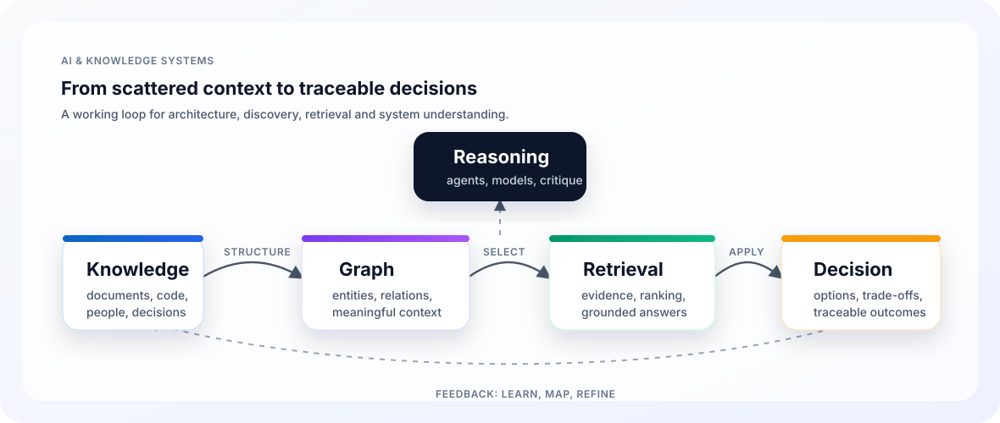

<h1 align="center">Micha Meierhoff</h1>

<p align="center">
  <strong>AI & Knowledge Systems Architect</strong><br />
  I build systems that make knowledge findable, structure visible and decisions easier.
</p>

<p align="center">
  <a href="https://github.com/mimeonline">
    
  </a>
</p>

<p align="center">
  
  
  
  
</p>

---

## The Signal

The pattern behind my work is simple:

> Most hard problems do not fail because information is missing. They fail because no one can see the system clearly enough.

I have worked for more than 20 years across software development, software architecture and enterprise architecture. Today I focus on AI-supported knowledge systems, GraphRAG, enterprise search, agentic coding and visual models that help people navigate complex technical and organizational landscapes.

My work sits between architecture, knowledge management, AI engineering and decision support.

---

## Current Focus

| Area | What I am exploring |
| --- | --- |
| Knowledge Systems | How teams can structure, connect and reuse knowledge instead of burying it in documents |
| GraphRAG & Search | How retrieval, graphs and LLMs can create traceable answers instead of plausible noise |
| Agentic Coding | How Codex-style workflows change software delivery, architecture work and personal tooling |
| Architecture Maps | How visual models, C4 automation and system maps can make architecture inspectable |
| Decision Systems | How AI tools can support better decisions without hiding evidence, context or trade-offs |

---

## Public Labs

| Project | Why it exists |
| --- | --- |
| [Meierhoff Systems](https://meierhoff-systems.de/) | My public home for AI systems, software architecture and practical system thinking |
| [GraphRAG Lab](https://graphrag-lab.meierhoff-systems.de/de) | A hands-on lab for GraphRAG, retrieval architecture and traceable AI systems |
| [System Thinking for Architects](https://system-thinking.meierhoff-systems.de/de) | Practical system thinking for software and enterprise architects |
| [GraphRAG Compass](https://graphrag-compass.meierhoff-systems.de/) | A field guide for GraphRAG, knowledge graphs, retrieval and enterprise agents |
| [Method Atlas](https://methodatlas.meierhoff-systems.de/) | An interactive method atlas for product, architecture, strategy and delivery work |
| [Nexonoma App](https://github.com/mimeonline/nexonoma-app) | A structure-first web platform for making complex knowledge models explicit |

Other ongoing work includes architecture mapping, C4 automation, agentic coding workflows and explainable intelligence systems.

---

## Operating System

```text
learn -> build -> apply -> map -> refine
```

- Models before buzzwords
- Proofs of concept before theory
- Visible artifacts before slide decks
- Systems over silos
- Context, evidence and traceability over confident black boxes

---

## Knowledge Systems Map

<p align="center">
  
</p>

---

## Toolkit

<p align="center">
  <a href="https://skillicons.dev">
    
  </a>
</p>

<p align="center">
  
  
  
  
  
  
  
</p>

---

## GitHub Telemetry

<p align="center">
  
  
</p>

<p align="center">
  
</p>

<p align="center">
  
</p>

<p align="center">
  
</p>

---

## Outside The Code

I am based in Hamburg, Germany. Away from software, I spend time with systems thinking, knowledge work, photography, music and converting a Peugeot Boxer camper into a mobile office for location-independent work.

<p align="center">
  <strong>Making complex systems easier to see, reason about and improve.</strong>
</p>
